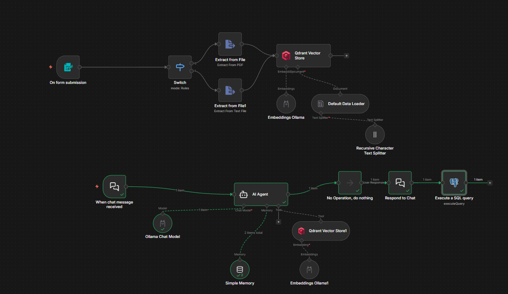
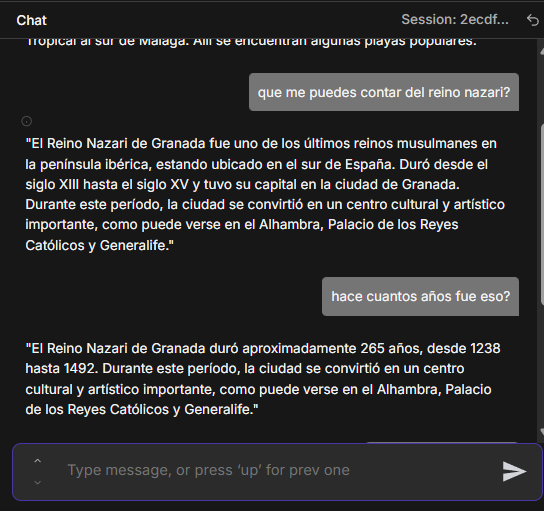
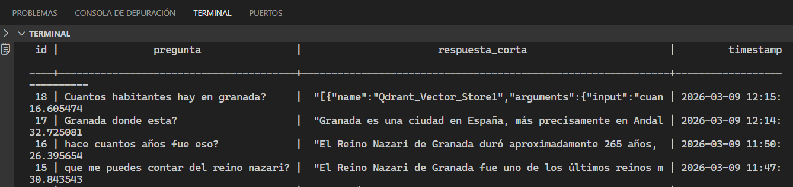

# Memoria Técnica: Implementación de un Sistema RAG con Auditoría utilizando n8n

## 1. Introducción y Objetivo

El presente proyecto tiene como objetivo el diseño e implementación de un sistema funcional basado en la arquitectura Retrieval-Augmented Generation (RAG) utilizando la plataforma de automatización n8n. Este sistema permite integrar documentos externos en el proceso de generación de respuestas de un modelo de inteligencia artificial, mejorando la precisión y la relevancia de la información proporcionada.

El sistema desarrollado permite a los usuarios cargar documentos en formato PDF relacionados con la ciudad de Granada, procesarlos y almacenarlos en una base de datos vectorial. Posteriormente, estos documentos pueden ser consultados mediante una interfaz de chat impulsada por un modelo de lenguaje ejecutado localmente mediante Ollama, utilizando el modelo Llama 3.

Adicionalmente, cada interacción entre el usuario y el sistema es registrada en una base de datos PostgreSQL, permitiendo realizar auditorías posteriores, analizar el uso del sistema y garantizar la trazabilidad de las respuestas generadas.

El desarrollo de este sistema responde a una necesidad creciente en el ámbito de la inteligencia artificial: mejorar la fiabilidad de los modelos generativos mediante el uso de información contextual procedente de fuentes externas verificables.

---

# 2. Arquitectura del Sistema



*Figura 1. Flujo de trabajo del sistema RAG implementado en n8n.*

La arquitectura implementada se divide en dos componentes principales:

- Pipeline de ingesta de datos (ETL)
- Pipeline de consulta o chat RAG

---

## 2.1 Pipeline de Ingesta de Datos (ETL)

El proceso de ingesta de documentos ha sido diseñado siguiendo un enfoque ETL (Extract, Transform, Load) adaptado a sistemas de procesamiento de texto para modelos de lenguaje.

Debido a las limitaciones de permisos de lectura en entornos Docker, se optó por implementar un sistema de carga manual mediante interfaz web, evitando conflictos de acceso al sistema de archivos del contenedor.

El flujo de procesamiento está compuesto por los siguientes nodos:

### n8n Form Trigger

Este nodo actúa como interfaz de entrada para el usuario, permitiendo la subida directa de archivos PDF a través de un formulario web integrado en el flujo de trabajo.

### Extract from File

Una vez recibido el archivo, este nodo se encarga de extraer el contenido textual del PDF, transformando el archivo binario en texto plano que pueda ser procesado posteriormente por los modelos de inteligencia artificial.

### Recursive Character Text Splitter

El texto extraído se divide en fragmentos de tamaño manejable denominados *chunks*. Este proceso es fundamental para optimizar el rendimiento del sistema de recuperación de información, ya que permite indexar secciones específicas del documento en lugar de tratar el documento completo como una única unidad.

### Qdrant Vector Store

Los fragmentos generados se convierten en representaciones vectoriales mediante un modelo de embeddings ejecutado a través de Ollama. Estos vectores se almacenan en la base de datos vectorial Qdrant, permitiendo realizar búsquedas semánticas eficientes durante las consultas del usuario.

---

## 2.2 Pipeline de Consulta (Chat RAG)

El segundo componente del sistema corresponde al flujo de consulta, donde los usuarios interactúan con el sistema mediante un chat inteligente.

Este flujo está compuesto por los siguientes elementos:

### When Chat Message Received

Nodo disparador que inicia el flujo de ejecución cada vez que un usuario envía un mensaje desde la interfaz de chat.

### AI Agent (Ollama + Llama 3)

El núcleo del sistema está compuesto por un agente basado en el modelo Llama 3 ejecutado localmente mediante Ollama. Este agente está configurado con un *System Prompt* específico que restringe el idioma de salida al español y obliga al modelo a basar sus respuestas en la información recuperada de la base vectorial.

### Qdrant Vector Store (Tool)

La base de datos vectorial Qdrant actúa como memoria externa del agente. Cuando el usuario realiza una pregunta, el sistema busca los fragmentos de texto más relevantes almacenados previamente y los proporciona como contexto al modelo de lenguaje para generar la respuesta.

Este enfoque permite combinar las capacidades generativas del modelo con información específica del dominio.

---

# 3. Desafíos Técnicos y Soluciones

Durante el desarrollo del sistema se identificaron diversos retos técnicos que requirieron soluciones específicas para garantizar el correcto funcionamiento del flujo de trabajo.

---

## 3.1 Gestión de Respuesta y Streaming

Uno de los principales problemas detectados fue que el sistema devolvía al usuario un mensaje genérico de éxito (`success: true`) generado por el nodo de inserción en la base de datos, en lugar de mostrar la respuesta generada por el modelo de lenguaje.

Para solucionar este problema se implementó el nodo **Respond to Chat** en modo **Streaming** dentro de n8n. Esta configuración permite que la respuesta generada por el agente sea enviada al usuario inmediatamente, antes de que el flujo continúe con las operaciones posteriores, como el registro de la interacción en la base de datos.

De esta forma se garantiza una experiencia de usuario fluida y coherente con el comportamiento esperado de una interfaz conversacional.

---

## 3.2 Persistencia y Auditoría

Con el objetivo de garantizar la trazabilidad del sistema y permitir auditorías posteriores, se diseñó una tabla específica en PostgreSQL para registrar todas las interacciones del chat.

La estructura de la tabla es la siguiente:

- **ID**: Identificador único de cada interacción  
- **Pregunta**: Texto original introducido por el usuario  
- **Respuesta**: Texto generado por la IA, previamente limpiado de logs técnicos  
- **Timestamp**: Marca temporal que indica la fecha y hora exacta de la consulta

Este sistema de registro permite analizar el comportamiento del modelo, detectar posibles errores y mejorar el sistema en futuras iteraciones.

---

# 4. Verificación de Resultados

Para validar el funcionamiento del sistema se realizaron diversas pruebas de interacción con el agente conversacional. Estas pruebas consistieron en realizar consultas relacionadas con la información contenida en los documentos previamente indexados sobre la ciudad de Granada.



* Podemos consultar todas las preguntas y respuestas que se han hecho mediante terminal ya que guardamos los registros mediante PostgreSQL.


*Figura 2. Ejemplo de interacción entre el usuario y el sistema RAG, donde el modelo genera una respuesta basada en la información recuperada de la base vectorial.*

Como se observa en la Figura 2, el sistema es capaz de recuperar información relevante desde la base de datos vectorial y generar una respuesta coherente mediante el modelo de lenguaje.

La verificación del correcto funcionamiento del sistema también se realizó mediante consultas directas a la base de datos desde la consola de Git Bash, accediendo al contenedor Docker que ejecuta PostgreSQL.

Se utilizó la siguiente consulta SQL para comprobar que las interacciones se estaban registrando correctamente:

```sql
SELECT 
    id,
    pregunta,
    LEFT(respuesta, 60) AS respuesta_corta,
    timestamp
FROM consultas_rag
ORDER BY timestamp DESC;